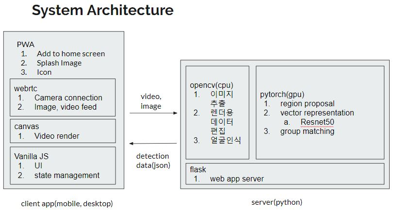
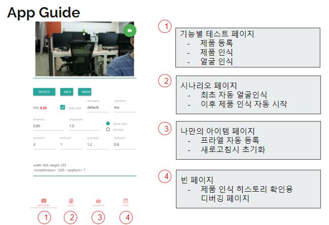

# Smart mirror 2nd project
 - few shot
 - universal
 - object detector

## server
 - flask
   - ssl supported for webrtc
 - pytorch
   - object detector
   - ~~universal bbox regression~~
 - opencv
   - Edgebox region proposal
   - face recognition  
 - architrcture     


## app
 - vanilla JS
 - material css
 - web rtc
 - menifest.json for a2hs
 - app pages  

 ---
## Demo
 - start server
```cmd
  python server.py --port 5000 --d F
```

- NOTE
  - GPU MUST REQUIRD!!
