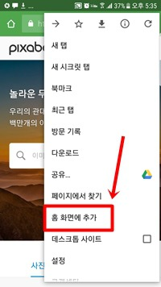

# Smart mirror 2nd project
 - few shot
 - universal
 - object detector

## server
 - flask
   - ssl supported for webrtc
 - pytorch
   - object detector
   - ~~universal bbox regression~~
 - opencv
   - Edgebox region proposal
   - face recognition  
 - architrcture     


## app
 - vanilla JS
 - material css
 - web rtc
 - menifest.json for a2hs
 - app pages guide  

 
 ---

## Demo
 - start server
```cmd
  python server.py --port 5000 --d F

  --port  <포트번호>
  --d     <flask debug 옵션, 개발시엔-T, 데모시엔-F>

  https://127.0.0.1:5000 로 접속 (https!!)
```
- add to home screen  
  - 모바일 크롬에서  


- MUST BE REQUIRD!!
  - python-opencv, pytorch, flask...
    - requirements.txt에 정리
  - GPU CUDA

- Derectories
```txt
├── detector.py -> 파이토치 오브젝트 디텍터 모델
├── haarcascade_frontalface_default.xml -> opencv 얼굴인식 모델
├── model.yml.gz -> opencv Edgebox region proposal 모델
├── preprocess.py -> opencv 비디오 - 이미지 전처리 모델
├── requirements.txt -> 필수 패키지 정보
├── server.py -> flask 실행 코드
├── ssl -> https용 인증서
│   ├── cert.pem
│   └── key.pem
├── static
│   ├── images
│   ├── images_ext -> 전처리된 레퍼런스 이미지 저장 공간(화장품 종류가 많아질수록 GPU메모리 및 초기 실행 시간이 길어집니다)
│   ├── images_ext_bak -> 기존 화장품 이미지 백업
│   ├── manifest.json -> splash, icon 저장
│   ├── objDetect.js -> 앱 주요 이벤트 관리
│   ├── smoother.js -> 앱 상태관리
│   ├── videos -> 앱에서 녹화한 비디오 저장 공간
│   └── videos_resized -> preprocess.py에서 리사이징한 비디오 저장
├── templates
│   └── index.html
└── utils.py -> 모델에 이용되는 부가적인 함수들 코드
```
